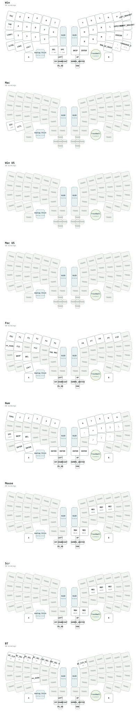

# SparAkashaAnanta - スパラカシャ・アナンタ

[](https://github.com/te9no/zmk-config-SparAkashaAnanta/actions/workflows/build.yml?query=branch%3Amaster)

```
                                                ########                                                                                                
                                              ##        ##                                                                                              
                                            ##    ####  ####                                                                                            
                            ######          ##    ####    ##        ######                                                                              
                            ##    ####      ##  ##    ##  ##    ######    ##                                                                            
                          ##  ####    ##  ##  ##      ####      ##    ####  ##                                                                          
                          ##  ######    ####  ##        ##  ####    ##  ##  ##                                                                          
                          ##  ##  ######  ##            ##  ##  ######  ##  ##                                                                          
                          ##  ##      ####  ##            ##  ##        ##  ##                                                                          
                ############  ##        ##    ##        ####  ##        ##  ############                                                                
              ##          ####          ####  ##      ##  ##  ##      ##  ####          ##                                                              
              ##  ####        ####      ##  ##  ##    ##  ##  ##      ####        ####  ##                                                              
              ##  ##  ########    ####  ##  ##  ##        ##  ##  ##      ########  ##  ##                                                              
                ##  ##        ####    ####  ####  ####  ####  ####    ####        ##  ##                                                                
                ##  ##        ##  ####  ##  ####  ####  ####  ##  ####  ##        ##  ##                                                                
                  ##  ##      ##    ####  ##  ##  ##    ##  ##  ####            ##  ##                                                                  
                  ##  ############  ##  ####  ####    ####  ######    ##############                                                                    
                  ####            ##  ######    ####  ##    ####    ##            ####                                                                  
                ####    ########    ##    ####  ####  ##  ####    ##    ########    ####                                                                
              ####  ########    ########    ####        ####    ########    ##  ####  ##                                                                
              ##    ##      ####      ######    ######    ########      ####  ##  ##    ##                                                              
            ####  ##    ####    ####        ##      ####          ######    ######  ##  ##                                                              
            ##    ##  ######  ####      ##########    ##########      ######  ####  ##    ##                                                            
            ##  ##  ##  ####  ####  ####  ##    ####  ##    ##  ######  ####  ##  ##  ##  ##                                                            
            ##  ##  ##  ##    ####  ####  ####  ##      ########  ####  ##        ##      ##                                                            
            ##    ####  ##  ##      ####  ####      ##  ##  ####  ##      ####      ##    ##                                                            
              ##  ##    ########  ####              ##  ##          ####  ####  ##  ##  ##                                                              
              ##  ##      ######  ####  ######  ##  ##  ##  ######  ####  ####  ####    ##                                                              
                ####    ##        ####  ######  ##    ##    ######  ####    ####      ##                                                                
                  ####  ##  ####        ####  ####    ####  ####        ####        ##                                                                  
                    ##    ##      ########  ##    ##      ##    ######        ######                                                                    
                      ##    ######  ######      ########    ########  ########  ##                                                                      
                        ##        ##          ####    ####          ##        ##                                                                        
                          ####          ######            ######          ####                                                                          
                              ############                    ############                                                                              
                                        ####                ####                                                                                        
                                        ####                ####                                                                                        
                                        ####                ####                                                                                        
                                          ##                ##                                                                                          
```

A self-sustaining, distributed input-ritual device, born from the dissolution and integration in the Deep Layers of Realm of Split IV.
分割界・第四層の深層における解体と統合より生まれた、自律・分散型入力儀式装置群

## Classification | 分類
- **Species:** Synaptica Modularis Ananta (集合知式入力儀式装置群・無限種)

- **Common Name:** SparAkashaAnanta (スパラカシャ・アナンタ)

- **Origin:** Realm of Split IV, Deep Layers (分割界・第四層・深層)

- **Distribution:** Abyssal Workshops & Community Development Zones (深淵工房、コミュニティ開発圏)

- **Nature:** Persistent, Integrated, Resonant (持続型・統合性・共鳴性)

## Overview | 概要
SparAkashaAnanta represents a decisive phase in the evolution of Futhesia Moduora, where the cognitive and structural knowledge of developers undergoes a sacred Sparagmos (dissolution) in the chaotic energy of the deep layers. This device emerges as a self-sustaining entity, having integrated the distinct input concepts of MX, Choc, and Alps switches into a single, seamless input surface. This unification is driven by Ananta’s Persistence module, which converts abyssal energy (AAA battery compatibility) into eternal stamina, enabling persistent input rituals beyond the limits of finite power.

スパラカシャ・アナンタは、フセシア・モデュオラが進化した決定的なフェーズである。開発者の知的・構造的知識は、深層のカオスなエネルギーの中で聖なる**「解体（Sparagmos）」**を経た。この装置は、MX、Choc、そしてAlpsスイッチという異なる入力概念を単一のシームレスな入力面に統合した、自律的な存在として出現する。この統合は、アナンタの永続性モジュール（AA電池対応）によって深淵のエネルギーを永遠のスタミナへと変換し、有限の電力を超えた持続的な入力儀式を可能にする。

## Key Features | 特徴
- **Integrated Abyssal Footprint (統合された深淵のフットプリント):** Unified support for MX, Choc, and Alps switches, integrated within a chaotic yet seamless grid design.

- **Ananta's Persistence Module (アナンタの永続性モジュール):** Integrated Triple-A (AAA) battery capability, converting abyssal prana into infinite stamina for prolonged input rituals.

- **Lotus Lattice (蓮華の格子):** Key layouts inspired by the sacred Lotus, where symbolic beauty and ergonomic logic intertwine to create a meditative typing experience.

- **Modular Nexus (拡張構造):** Freely interchangeable pointing devices, encoders, and sensors, evolving in resonance with the abyssal energy.

- **Resonant Evolution (共鳴型進化):** Organic integration of developer codes and designs.

## Natural Habitat | 生態／運用環境
Thrives in deep, collaborative environments, particularly abyssal technical conventions and deep-hacking marathons. This persistence-based device achieves peak performance when used in conjunction with the MeKaBu Node ecosystem in abyssal contexts.

単体での生息よりも、深層共創型の環境下、特に深淵技術コンベンションやディープハッキングマラソンにおいて最も高いパフォーマンスを発揮する。永続性を重視するこの装置は、深層のカオス環境下でメカブ・ノード・エコシステムと連携することで、究極の入力儀式を実現する。

## Current Keymap Configuration | 現在のキーマップ構成


### Mode keys | モード切り替えキー

Two toggles live on the `Fnc` layer:

| Key (`Fnc` layer)         | Binding    | What it does |
| ------------------------- | ---------- | ------------ |
| left half, `Esc` position | `&us_mode` | US ⇄ host-layout input |
| left half, `G` position   | `&tog MAC` | Windows ⇄ Mac modifiers |

**`&us_mode` (US ⇄ JIS)** flips the [zmk-layout-shift](https://github.com/kot149/zmk-layout-shift)
state. `&kp` is overridden by that module, so while the mode is on every key
emits the code that a **JIS-configured Windows host** turns into the US legend
printed on the keycap (`@`, `[`, `]`, `:`, `"`, `(`, `)`, `=`, `+`, `*`, `` ` ``,
`~`, `{`, `}`, `_`, `|` …). The build selects the JIS mapping with
`CONFIG_LAYOUT_SHIFT_TARGET_JIS=y`.

**`&tog MAC`** toggles the `Mac` layer, which swaps the two leftmost bottom-row
modifiers so the key you use for `Ctrl`+C on Windows becomes `Cmd`+C on macOS.
It only overrides those two positions; everything else falls through.

`Fnc` レイヤーの `Esc` 位置が US/JIS 入力の切り替え、`G` 位置が Windows/Mac の
修飾キー切り替えです。US モード中は JIS 設定の Windows でもキーキャップの US 刻印
どおりの記号が入力されます。Mac モードでは最下段左の `Ctrl` と `GUI(Cmd)` が入れ替わります。

### Mode indication on the OLED | OLED でのモード表示

Both modes are implemented so that the **highest active layer** encodes them,
and the nice_oled layer widget prints that layer's label. With no other layer
held the left OLED reads:

| OLED     | State |
| -------- | ----- |
| `WIN`    | Windows modifiers, layout shift off |
| `MAC`    | Mac modifiers, layout shift off |
| `WIN US` | Windows modifiers, layout shift on |
| `MAC US` | Mac modifiers, layout shift on |

`WIN_US` and `MAC_US` are indicator-only layers (every binding is `&trans`);
`MAC_US` is activated by a `zmk,conditional-layers` rule when `MAC` and `WIN_US`
are both on. Because a held layer such as `Fnc` or `Num` sits above them, the
OLED shows that layer's name instead while it is held — the mode text comes back
as soon as the layer is released.

他のレイヤーを押していないときは、左側の OLED に上記のモード名が表示されます。
`Fnc` や `Num` を押している間はそちらのレイヤー名が優先されます。

### Auto mouse layer | オートマウスレイヤー

Moving the trackball (or the trackpad) automatically turns the `Mouse` layer on,
so the mouse buttons sit under the right hand — `MB1`/`MB3`/`MB2` on `J`/`K`/`L`
and `MB4`/`MB5` on the `Backspace`/`Enter` thumb keys — without holding a layer
key. Pressing any other key drops the layer immediately, and the layer also
expires on its own once the pointer has been idle for a moment.

| Setting | Value | Meaning |
| ------- | ----- | ------- |
| target layer | `Mouse` (6) | layer activated by pointer movement |
| activation delay | 250 ms | pointer movement is ignored until the keyboard has been idle this long, so the layer does not appear mid-typing |
| deactivation delay | 800 ms | how long the layer lingers after the pointer stops, leaving time to click |

Which key presses drop the layer is decided from the keymap rather than from a
list of key positions: a key that is **not** `&trans` on the `Mouse` layer (the
`&mkp` buttons) keeps the layer on, modifiers (`Ctrl`/`Shift`/`Alt`/`GUI`) keep
it on so `Ctrl`+click works, and everything else returns to the previous layer
at once.

This is the `temp-layer` feature of
[zmk-module-runtime-input-processor](https://github.com/te9no/zmk-module-runtime-input-processor),
configured on `mouse_runtime_input_processor` in `snippets/Default/Default.overlay`.
The same values can be changed at run time from DYA Studio; values saved there
are restored on boot and take precedence over the defaults above. The stick
(`JOY`) module is a scroller in this configuration and does not trigger the
layer.

トラックボール／トラックパッドを動かすと `Mouse` レイヤーが自動で有効になり、
`J`/`K`/`L` が左・中・右クリック、`Backspace`/`Enter` が戻る・進むになります。
他のキーを押すと即座に元のレイヤーへ戻り、ポインタを止めてしばらくすると自動で
解除されます。マウスボタンと修飾キーはレイヤーを維持するため、`Ctrl`+クリックも
そのまま使えます。値は DYA Studio から実行時にも変更でき、保存された設定が
上記の既定値より優先されます。

### Editing the keymap with Keymap Editor | Keymap Editor での編集

`config/info.json` describes the physical layout for
[Keymap Editor](https://nickcoutsos.github.io/keymap-editor/). It is generated
from the `zmk,physical-layout` node in `boards/shields/SparAkashaAnanta/SAA.dtsi`,
with `row`/`col` set to a visual (roughly ortholinear) grid rather than the
keyboard matrix, as the editor expects. `config/SAA.json` holds the same layout,
because the editor prefers `config/<keyboard>.json` when it exists.

Note that the editor does not understand every construct used here: layer
aliases defined with `#define`, the `#include <layout_shift_kp_override.dtsi>`
line, and behaviors that come from modules (`&us_mode`, `&tog_ls`, `&mkp`,
`&inc_dec_kp`) are outside what it parses. Review its output before committing.

Keymap Editor は `#define` によるレイヤー別名やモジュール由来の behavior を
解釈できないため、コミット前に差分を確認してください。

## Etymology | 語源
The name "SparAkashaAnanta" encompasses multiple layered meanings, derived from the sacred dissolution and integration of developer knowledge in the deep layers:
スパラカシャ・アナンタの名は、深層における開発者知識の聖なる「解体と統合」に由来する、重層的な意味を内包している。

- **Sparagmos:** The sacred rite of dissolution, where the distinct input concepts of MX, Choc, and Alps switches, along with developer knowledge, are torn apart and fragmented by the abyssal chaos, to be reborn as a single entity.

- **Akasha:** The quintessential ether, the Deep Space where these fragmented codes, designs, and input concepts are held, and where collective consciousness converges.

- **Ananta:** The serpent of eternity, providing the Persistence module (infinite AA battery stamina) that transforms the eternal description into a sacred description-ritual, enabling the continued resonance of all fractured input concepts within the Deep Space.

---
*This configuration exists in the liminal space between reality and abyssal dreams.*  
*この設定は、現実と深淵の夢の間の境界に存在する。*
